# 1C Metacode MCP Server

Загружает метаданные и код конфигураций 1С в графовую базу данных Neo4j и предоставляет инструменты
MCP, веб-консоль и встроенного AI агента для анализа данных конфигурации.

## Основные возможности

- Загрузка всех метаданных конфигураций 1С в граф Neo4j из отчёта по конфигурации (`.txt`) или прямо
  из XML выгрузки.
- Загрузка расширений 1С в один проект с базовой конфигурацией, со связями между ними и сравнением
  объектов расширения с базовыми.
- Загрузка данных управляемых форм: реквизиты, элементы, события, команды; привязка событий форм и
  элементов, команд к обработчикам.
- Загрузка предопределённых значений, прав ролей и подписок на события с привязкой к обработчикам.
- Загрузка справки по объектам метаданных с полнотекстовым поиском объектов по справке и другим
  описательным полям.
- Загрузка сигнатур процедур/функций из всех модулей (включая модуль формы обычных форм) и построение
  графа вызовов.
- Загрузка тел процедур/функций (включая модуль формы обычных форм) с полнотекстовым, векторным и
  гибридным поиском по описаниям.
- Широкая связность объектов метаданных: в реквизитах, в элементах управления формы, в регистрах
  накопления/сведений, в движениях документов по регистрам, в правах доступа.
- Инкрементальная загрузка изменившихся данных по расписанию (метаданные и код).
- Семантический поиск по **телу** кода BSL.
- Генерация LLM-сводок по объектам метаданных и поиск объектов по этим сводкам.
- Веб-консоль (просмотр метаданных, форм, кода, статистики) и встроенный AI агент.
- Мультипроектность: несколько проектов (базовая конфигурация + расширения) одновременно; поиск
  фильтруется по проекту автоматически, при этом из одного проекта можно обращаться к другим.
- Ответы MCP-инструментов максимально сжимаются как с помощью формата TOON, так и собственной системой компактизации.

## Структура данных

```mermaid
graph TB
    %% Иерархия: проект = базовая конфигурация + расширения
    Project(["Project<br/>Проект"]) -->|"HAS_CONFIGURATION"| Configuration(["Configuration<br/>Базовая конфигурация"])
    Project -->|"HAS_CONFIGURATION"| ExtConfiguration(["Configuration<br/>Конфигурация расширения<br/>(is_extension)"])
    ExtConfiguration -->|"EXTENDS"| Configuration
    Configuration -->|"HAS_CATEGORY"| MetadataCategory(["MetadataCategory<br/>Категория метаданных"])

    subgraph g_core [" "]
        MetadataObject(["MetadataObject<br/>Объект метаданных"])
        Role(["MetadataObject<br/>Роль"])
        Role -->|"GRANTS_ACCESS_TO"| MetadataObject
    end
    MetadataCategory -->|"CONTAINS_OBJECT"| MetadataObject
    MetadataCategory -->|"CONTAINS_OBJECT"| Role

    %% Данные и атрибуты
    subgraph g_data [" "]
        Attribute(["Attribute<br/>Атрибут"])
        TabularPart(["TabularPart<br/>Табличная часть"])
        TabularAttribute(["Attribute<br/>Атрибут табл. части"])
        Resource(["Resource<br/>Ресурс"])
        Dimension(["Dimension<br/>Измерение"])
        TabularPart -->|"HAS_ATTRIBUTE"| TabularAttribute
    end
    MetadataObject -->|"HAS_ATTRIBUTE"| Attribute
    MetadataObject -->|"HAS_TABULAR_PART"| TabularPart
    MetadataObject -->|"HAS_RESOURCE"| Resource
    MetadataObject -->|"HAS_DIMENSION"| Dimension

    %% Дополнительные сущности объекта
    subgraph g_child [" "]
        Layout(["Layout<br/>Макет"])
        Characteristic(["Characteristic<br/>Характеристика"])
        EnumValue(["EnumValue<br/>Значение перечисления"])
        JournalGraph(["JournalGraph<br/>Граф журнала"])
        AccountingFlag(["AccountingFlag<br/>Признак учёта"])
        DimensionAccountingFlag(["DimensionAccountingFlag<br/>Признак учёта субконто"])
        PredefinedItem(["PredefinedItem<br/>Предопределённый элемент"])
        PredefinedChild(["PredefinedItem<br/>Дочерний элемент"])
        SubsystemChild(["MetadataObject<br/>Дочерний объект<br/>(подсистемы)"])
        PredefinedItem -->|"HAS_CHILD"| PredefinedChild
    end
    MetadataObject -->|"HAS_LAYOUT"| Layout
    MetadataObject -->|"HAS_CHARACTERISTIC"| Characteristic
    MetadataObject -->|"HAS_ENUM_VALUE"| EnumValue
    MetadataObject -->|"HAS_GRAPH"| JournalGraph
    MetadataObject -->|"HAS_ACCOUNTING_FLAG"| AccountingFlag
    MetadataObject -->|"HAS_DIMENSION_ACCOUNTING_FLAG"| DimensionAccountingFlag
    MetadataObject -->|"HAS_PREDEFINED"| PredefinedItem
    MetadataObject -->|"CONTAINS_OBJECT"| SubsystemChild

    %% Использование и движения
    subgraph g_usage [" "]
        UsedInTarget(["Target Object<br/>Целевой объект"])
        RegisterObject(["Register<br/>Регистр"])
    end
    MetadataObject -->|"USED_IN"| UsedInTarget
    MetadataObject -->|"DO_MOVEMENTS_IN"| RegisterObject

    %% Формы и интерфейс
    subgraph g_form [" "]
        Form(["Form<br/>Форма"])
        FormControl(["FormControl<br/>Элемент формы"])
        FormControlChild(["FormControl<br/>Дочерний элемент"])
        FormControlEvent(["FormEvent<br/>Событие элемента"])
        FormEvent(["FormEvent<br/>Событие формы"])
        FormAttribute(["FormAttribute<br/>Атрибут формы"])
        FormEventAction(["FormEventAction<br/>Действие события"])
        FormCommand(["Command<br/>Команда формы"])
        EventHandler(["Routine<br/>Обработчик события"])
        ControlEventHandler(["Routine<br/>Обработчик события"])
        FormCommandHandler(["Routine<br/>Обработчик команды формы"])
        BindTarget(["Bind Target<br/>Цель связывания"])
        LinkedCommand(["Command<br/>Команда"])
        Form -->|"HAS_CONTROL"| FormControl
        Form -->|"HAS_EVENT"| FormEvent
        Form -->|"HAS_FORM_ATTRIBUTE"| FormAttribute
        Form -->|"HAS_COMMAND"| FormCommand
        FormControl -->|"HAS_CHILD"| FormControlChild
        FormControl -->|"HAS_EVENT"| FormControlEvent
        FormControl -->|"LINKS_TO_COMMAND"| LinkedCommand
        FormEvent -->|"HAS_EVENT_ACTION"| FormEventAction
        FormEvent -->|"HAS_HANDLER"| EventHandler
        FormControlEvent -->|"HAS_HANDLER"| ControlEventHandler
        FormCommand -->|"HAS_HANDLER"| FormCommandHandler
    end
    MetadataObject -->|"HAS_FORM"| Form
    FormControl -->|"BINDS_TO"| BindTarget

    %% Команды, HTTP, подписки
    subgraph g_cmd [" "]
        Command(["Command<br/>Команда"])
        UrlTemplate(["UrlTemplate<br/>Шаблон URL"])
        UrlMethod(["UrlMethod<br/>Метод URL"])
        UrlHandler(["Routine<br/>Обработчик HTTP"])
        EventSubscription(["EventSubscription<br/>Подписка на событие"])
        EventSubHandler(["Routine<br/>Обработчик подписки"])
        CommandHandler(["Routine<br/>Обработчик команды"])
        UrlTemplate -->|"HAS_URL_METHOD"| UrlMethod
        UrlMethod -->|"HAS_HANDLER"| UrlHandler
        EventSubscription -->|"USES_HANDLER"| EventSubHandler
        Command -->|"HAS_HANDLER"| CommandHandler
    end
    MetadataObject -->|"HAS_COMMAND"| Command
    MetadataObject -->|"HAS_URL_TEMPLATE"| UrlTemplate
    MetadataObject -->|"HAS_EVENT_SUBSCRIPTION"| EventSubscription

    %% Модули и код
    subgraph g_code [" "]
        Module(["Module<br/>Модуль"])
        Routine(["Routine<br/>Процедура/Функция"])
        CalledRoutine(["Called Routine<br/>Вызываемая процедура"])
        RoutineCodeUnit(["RoutineCodeUnit<br/>Единица кода"])
        Module -->|"DECLARES"| Routine
        Routine -->|"CALLS"| CalledRoutine
        Routine -->|"HAS_CODE_UNIT"| RoutineCodeUnit
        RoutineCodeUnit -->|"OF_ROUTINE"| Routine
    end
    MetadataObject -->|"HAS_MODULE"| Module

    %% Расширения 1С: содержимое расширения ↔ базовые объекты
    subgraph g_ext [" "]
        ExtCat(["MetadataCategory<br/>Категория (расширение)"])
        ExtObject(["MetadataObject<br/>Объект расширения"])
        ExtForm(["Form<br/>Форма расширения"])
        ExtAction(["FormEventAction<br/>Действие расширения"])
        ExtModule(["Module<br/>Модуль расширения"])
        ExtRoutine(["Routine<br/>Процедура расширения"])
        ExtCat -->|"CONTAINS_OBJECT"| ExtObject
        ExtObject -->|"HAS_FORM"| ExtForm
        ExtObject -->|"HAS_MODULE"| ExtModule
        ExtModule -->|"DECLARES"| ExtRoutine
        ExtForm -->|"HAS_EVENT_ACTION"| ExtAction
    end
    ExtConfiguration -->|"HAS_CATEGORY"| ExtCat
    ExtObject -->|"ADOPTED_FROM"| MetadataObject
    ExtForm -->|"ADOPTED_FROM"| Form
    ExtModule -->|"EXTENDS_MODULE"| Module
    ExtRoutine -->|"EXTENDS_ROUTINE"| Routine
    ExtAction -->|"EXTENDS_ACTION"| FormEventAction

    style g_ext fill:none,stroke:none

    style g_core fill:none,stroke:none
    style g_data fill:none,stroke:none
    style g_child fill:none,stroke:none
    style g_usage fill:none,stroke:none
    style g_form fill:none,stroke:none
    style g_cmd fill:none,stroke:none
    style g_code fill:none,stroke:none

    %% Стили узлов
    classDef projectClass fill:#FF6B6B,stroke:#C92A2A,stroke-width:2px,color:#000000
    classDef configClass fill:#4ECDC4,stroke:#26A69A,stroke-width:2px,color:#000000
    classDef categoryClass fill:#45B7D1,stroke:#1976D2,stroke-width:2px,color:#000000
    classDef objectClass fill:#96CEB4,stroke:#388E3C,stroke-width:2px,color:#000000
    classDef formClass fill:#FFEAA7,stroke:#FD8D3C,stroke-width:2px,color:#000000
    classDef formControlClass fill:#AED6F1,stroke:#3498DB,stroke-width:2px,color:#000000
    classDef formEventClass fill:#FF69B4,stroke:#C2185B,stroke-width:2px,color:#000000
    classDef formAttrClass fill:#A3E4D7,stroke:#1ABC9C,stroke-width:2px,color:#000000
    classDef formEventActionClass fill:#F5B7B1,stroke:#E74C3C,stroke-width:2px,color:#000000
    classDef tabularClass fill:#F7DC6F,stroke:#F39C12,stroke-width:2px,color:#000000
    classDef resourceClass fill:#F8C471,stroke:#E67E22,stroke-width:2px,color:#000000
    classDef dimensionClass fill:#82E0AA,stroke:#27AE60,stroke-width:2px,color:#000000
    classDef targetClass fill:#CACFD2,stroke:#7F8C8D,stroke-width:2px,color:#000000
    classDef moduleClass fill:#98D8C8,stroke:#16A085,stroke-width:2px,color:#000000
    classDef routineClass fill:#F1948A,stroke:#E74C3C,stroke-width:2px,color:#000000
    classDef codeUnitClass fill:#D7BDE2,stroke:#8E44AD,stroke-width:2px,color:#000000
    classDef commandClass fill:#E1BEE7,stroke:#9C27B0,stroke-width:2px,color:#000000
    classDef urlTemplateClass fill:#F9E79F,stroke:#F1C40F,stroke-width:2px,color:#000000
    classDef urlMethodClass fill:#D98880,stroke:#CD6155,stroke-width:2px,color:#000000
    classDef eventSubClass fill:#AEB6BF,stroke:#5D6D7E,stroke-width:2px,color:#000000
    classDef predefinedClass fill:#BB8FCE,stroke:#8E44AD,stroke-width:2px,color:#000000
    classDef bindTargetClass fill:#D5DBDB,stroke:#BDC3C7,stroke-width:2px,color:#000000
    classDef layoutClass fill:#F0E68C,stroke:#DAA520,stroke-width:2px,color:#000000
    classDef characteristicClass fill:#DEB887,stroke:#CD853F,stroke-width:2px,color:#000000
    classDef enumValueClass fill:#FFA07A,stroke:#FF6347,stroke-width:2px,color:#000000
    classDef journalGraphClass fill:#20B2AA,stroke:#008B8B,stroke-width:2px,color:#000000
    classDef accountingFlagClass fill:#87CEEB,stroke:#4682B4,stroke-width:2px,color:#000000
    classDef dimensionAccountingFlagClass fill:#DDA0DD,stroke:#BA55D3,stroke-width:2px,color:#000000
    classDef subsystemChildClass fill:#A8E6CF,stroke:#3D9970,stroke-width:2px,color:#000000
    classDef formControlChildClass fill:#B3E5FC,stroke:#03A9F4,stroke-width:2px,color:#000000
    classDef tabularAttributeClass fill:#90CAF9,stroke:#2196F3,stroke-width:2px,color:#000000
    classDef roleClass fill:#F1948A,stroke:#922B21,stroke-width:2px,color:#000000
    classDef extClass fill:#FAD7A0,stroke:#B9770E,stroke-width:2px,color:#000000

    %% Применение стилей
    class Project projectClass
    class Configuration configClass
    class MetadataCategory categoryClass
    class MetadataObject,SubsystemChild subsystemChildClass
    class Form formClass
    class FormControl,FormControlChild formControlChildClass
    class FormEvent,FormControlEvent formEventClass
    class FormAttribute formAttrClass
    class FormEventAction formEventActionClass
    class Attribute,TabularAttribute tabularAttributeClass
    class TabularPart tabularClass
    class Resource resourceClass
    class Dimension dimensionClass
    class UsedInTarget,RegisterObject targetClass
    class Module moduleClass
    class Routine,CalledRoutine,EventHandler,ControlEventHandler,UrlHandler,EventSubHandler,CommandHandler,FormCommandHandler routineClass
    class RoutineCodeUnit codeUnitClass
    class Command,FormCommand,LinkedCommand commandClass
    class UrlTemplate urlTemplateClass
    class UrlMethod urlMethodClass
    class EventSubscription eventSubClass
    class PredefinedItem,PredefinedChild predefinedClass
    class BindTarget bindTargetClass
    class Layout layoutClass
    class Characteristic characteristicClass
    class EnumValue enumValueClass
    class JournalGraph journalGraphClass
    class AccountingFlag accountingFlagClass
    class DimensionAccountingFlag dimensionAccountingFlagClass
    class Role roleClass
    class ExtConfiguration,ExtCat,ExtObject,ExtForm,ExtModule,ExtRoutine,ExtAction extClass
```



## Быстрый старт

Требуется Docker и Docker Compose; свободные порты 7474/7687 (Neo4j) и 6001 (MCP-сервер и веб-консоль).

1. Скопируйте `.env.example.minimal` в `.env` (минимальный набор для старта; полный список — в
   `.env.example`) и задайте как минимум `NEO4J_PASSWORD` и `PROJECT_NAME`.
2. Скопируйте `docker-compose.example.yml` в `docker-compose.yml`, задайте `PROJECT_NAME` (и порт для
   каждого проекта при мультипроекте).
3. Разместите данные: `data/prj1/metadata` (отчёт по конфигурации `.txt`), `data/prj1/code`
   (XML-выгрузка), при необходимости `data/prj1/extensions/<ExtName>`.
4. Запустите:

```bash
docker compose up -d
```

Подробная инструкция — в [docs/setup.md](docs/setup.md).

## Обновление

```bash
docker compose pull
docker compose up -d --force-recreate
```

Полный сброс с удалением базы:

```bash
docker compose down --volumes
docker compose up -d --force-recreate
```

## Сервисы

- **Neo4j Browser** — http://localhost:7474 (логин `neo4j`, пароль из `NEO4J_PASSWORD`)
- **Bolt** — `bolt://localhost:7687`
- **MCP-сервер** — http://localhost:6001/mcp (порт зависит от проекта)
- **Веб-консоль** — http://localhost:6001/console (при `WEB_CONSOLE_ENABLED=true`). Токен передаётся в
  URL: для админа `http://localhost:6001/console?admin_token=<WEB_CONSOLE_ADMIN_TOKEN>`, для
  пользователя `?user_token=<токен>`.

Логи приложения:

```bash
docker compose logs -f <имя-сервиса>
```

## Подключение MCP-клиента

Транспорт по умолчанию — streamable-http (при `MCP_USE_SSE=true` — SSE). Пример конфигурации клиента:

```json
{
  "mcpServers": {
    "1c-metacode": {
      "url": "http://localhost:6001/mcp",
      "type": "streamable-http",
      "timeout": 300
    }
  }
}
```

Список и назначение инструментов — в [docs/mcp-tools.md](docs/mcp-tools.md).

## Документация

| Документ | О чём |
|----------|-------|
| [docs/architecture.md](docs/architecture.md) | архитектура, модель графа, где что хранится |
| [docs/setup.md](docs/setup.md) | установка, запуск, обслуживание |
| [docs/loading-and-updates.md](docs/loading-and-updates.md) | загрузка данных, флаги, инкрементальное обновление |
| [docs/mcp-tools.md](docs/mcp-tools.md) | справочник инструментов MCP |
| [docs/search.md](docs/search.md) | режимы поиска и как их выбирать |
| [docs/bsl-code-search.md](docs/bsl-code-search.md) | семантический поиск по телу кода BSL |
| [docs/bsl-code-search-benchmark.md](docs/bsl-code-search-benchmark.md) | бенчмарк режимов поиска по коду BSL |
| [docs/object-summary.md](docs/object-summary.md) | LLM-сводки объектов и поиск по ним |
| [docs/web-console.md](docs/web-console.md) | веб-консоль |
| [docs/console-agent.md](docs/console-agent.md) | встроенный AI агент |
| [docs/extensions.md](docs/extensions.md) | расширения 1С |

Полный перечень переменных окружения с дефолтами и комментариями — в `.env.example`.

## Changelog

Последние изменения — v2.0.0 (2026-07-07): поддержка расширений 1С, семантический поиск по коду BSL,
AI-сводки объектов, веб-консоль со встроенным агентом, инкрементальная загрузка, загрузка из XML-дампа.

Полная история версий — в [CHANGELOG.md](CHANGELOG.md).
