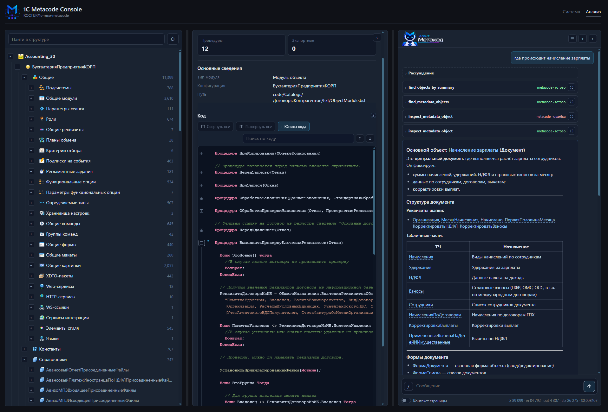

# Встроенный агент веб-консоли

AI агент, живущий на главной странице веб-консоли. Он отвечает на вопросы по конфигурации, используя
те же инструменты, что и внешние MCP-клиенты. Это самостоятельная подсистема со своей конфигурацией
LLM, профилями моделей и подключением внешних MCP-серверов, поэтому вынесена в отдельный документ. Про
саму консоль — [web-console.md](web-console.md).

## Включение

- `CONSOLE_AGENT_ENABLED` — главный флаг. По умолчанию выключен; тогда консоль показывает агента в
  отключённом состоянии.

## Настройка LLM: два способа

Модель и endpoint агента можно задать двумя способами.

### 1. Через переменные окружения (один профиль)

Простой вариант с единственной моделью: `CONSOLE_AGENT_LLM_API_BASE`, `CONSOLE_AGENT_LLM_API_KEY`,
`CONSOLE_AGENT_MODEL`, `CONSOLE_AGENT_LLM_TEMPERATURE`, таймаут и прокси. Endpoint должен быть
OpenAI-совместимым.

### 2. Через YAML-файл (несколько профилей)

Для нескольких моделей/провайдеров рядом с `.env` кладётся файл `console_agent_llm.yaml` (по образцу
`console_agent_llm.example.yaml`) и монтируется в контейнер. **Если файл существует, профили, модели,
endpoint-ы и ключи берутся из него**, а не из переменных.

Структура файла:

- `endpoints` — провайдеры с их `api_base`, `api_key`, таймаутом и (опционально) прокси. Типовые:
  OpenRouter, OpenAI, DeepSeek, LM Studio, локальный LiteLLM. Для локальных endpoint-ов прокси можно
  отключить (`proxy: false`).
- `profiles` — именованные профили: каждый ссылается на `endpoint`, задаёт `model` и параметры
  (например, `temperature`).
- `default_profile` — профиль по умолчанию.

Пользователь может переключать профиль прямо в интерфейсе агента (меню выбора модели).

## Инструменты агента

- **Локальный MCP metacode подключается автоматически** — агент из коробки видит все инструменты этого
  проекта; отдельно прописывать его не нужно.
- `CONSOLE_AGENT_LOCAL_MCP_EXCLUDED_TOOLS` — позволяет скрыть отдельные локальные инструменты **только
  от агента**, не отключая их для внешних MCP-клиентов.
- `CONSOLE_AGENT_EXTERNAL_MCP_SERVERS` — JSON-массив внешних MCP-серверов, которые нужно подключить к
  агенту дополнительно (локальный metacode сюда добавлять не нужно). Таймаут по умолчанию —
  `CONSOLE_AGENT_MCP_TIMEOUT`.

## Поведение в диалоге

- **Контекст страницы** — агент учитывает, что открыто в разделе «Анализ», чтобы отвечать предметно.
- **Ссылки на объекты** — в ответах агент формирует ссылки, по которым можно перейти к объекту в
  структуре конфигурации (раздел «Анализ»).
- **Чаты** — история диалогов сохраняется; лимит числа чатов на пользователя —
  `CONSOLE_AGENT_MAX_CHATS_PER_USER`.
- **Streaming** — ответы приходят потоково.
- **Лимиты** — максимум шагов агента за ход (`CONSOLE_AGENT_MAX_TURNS`), лимит элементов сессии
  (`CONSOLE_AGENT_SESSION_ITEM_LIMIT`), обрезка объёмного вывода инструментов
  (`CONSOLE_AGENT_TOOL_OUTPUT_*`).
- **Reasoning** — для моделей с рассуждениями настраиваются усилие и показ хода мысли
  (`CONSOLE_AGENT_REASONING_EFFORT`, `CONSOLE_AGENT_REASONING_SUMMARY`, `CONSOLE_AGENT_SHOW_REASONING`).
- **Usage** — потребление токенов по ходам доступно в интерфейсе.

Сессии и чаты хранятся в отдельных SQLite-файлах (`CONSOLE_AGENT_SESSION_SQLITE_PATH`,
`CONSOLE_AGENT_CHATS_SQLITE_PATH`).

## Типовые сценарии

- «Найди объект, отвечающий за …» — агент подберёт нужный инструмент поиска.
- «Покажи структуру формы …», «где используется …», «что делает эта процедура» — агент вызывает
  соответствующие инструменты и собирает ответ.
- Подключение внешнего MCP-сервера (например, дополнительного инструментария на хосте) расширяет набор
  доступных агенту действий помимо локального metacode.

## Типовые проблемы

- **Агент отключён** — не включён `CONSOLE_AGENT_ENABLED`.
- **Изменения в переменных LLM не применяются** — рядом лежит `console_agent_llm.yaml`, и он имеет
  приоритет над переменными окружения.
- **Локальный endpoint не отвечает через прокси** — для него нужно отключить прокси (`proxy: false` в
  YAML или соответствующая настройка), иначе запросы к `host.docker.internal` уходят в прокси.
- **Внешний MCP-сервер не подключается** — проверьте JSON в `CONSOLE_AGENT_EXTERNAL_MCP_SERVERS` и
  доступность адреса из контейнера.
