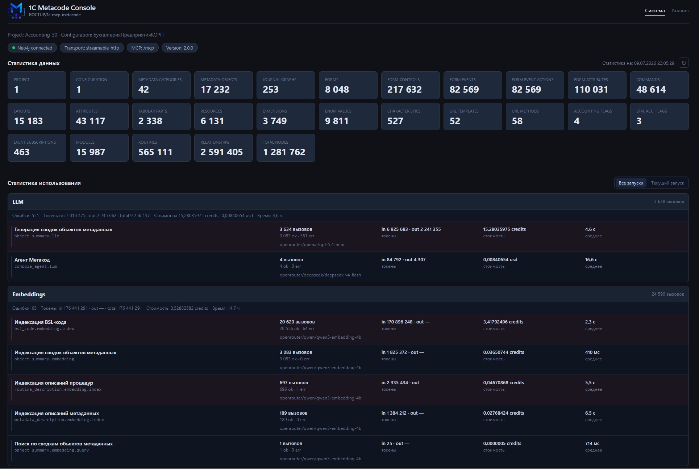
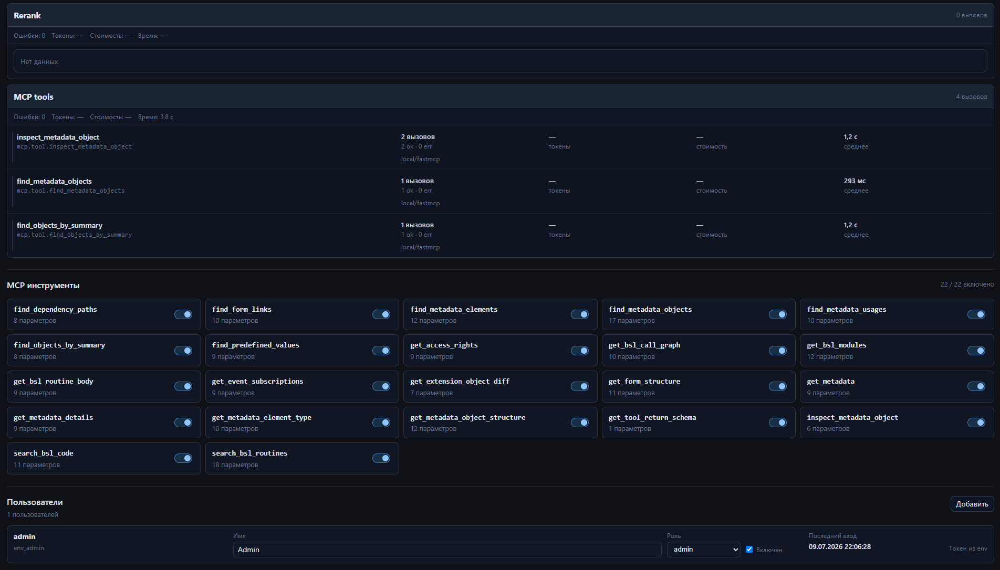

# Веб-консоль

Веб-интерфейс поверх того же графа, что и MCP-сервер: просмотр метаданных, кода и статистики,
управление доступом и инструментами, а также встроенный AI агент. Работает на том же порту, что и
MCP-сервер. Про самого агента — отдельный документ [console-agent.md](console-agent.md).

## Включение и доступ

- `WEB_CONSOLE_ENABLED` — включает консоль.
- Адрес — `http://<хост>:<порт>/console` (базовый путь настраивается `WEB_CONSOLE_PATH`, префикс
  JSON-API — `WEB_CONSOLE_API_PREFIX`).

### Авторизация

Доступ по токенам двух уровней:

- **admin** — `WEB_CONSOLE_ADMIN_TOKEN` (обязателен для страницы «Система» и управления пользователями);
- **user** — токены обычных пользователей.

Токен передаётся query-параметром в URL или заголовком:

- админ — `.../console?admin_token=<WEB_CONSOLE_ADMIN_TOKEN>` (или заголовок `X-Console-Admin-Token`);
- пользователь — `.../console?user_token=<токен>` (или заголовок `X-Console-User-Token`).

Пользователей можно создавать при старте через `WEB_CONSOLE_SEED_USERS` (JSON-массив: создаются те,
чей логин ещё не существует). Список пользователей и их токены хранятся в отдельном SQLite-файле
(`WEB_CONSOLE_USERS_SQLITE_PATH`). Администратор может добавлять пользователей и перевыпускать их токены
прямо из интерфейса.

## Страницы

Консоль состоит из трёх разделов.

### Главная — `/console`

Встроенный AI агент: чат по конфигурации, использующий инструменты MCP. Настройка и поведение агента
описаны в [console-agent.md](console-agent.md).

### «Система» — `/console/system`

Административный раздел (нужен admin-токен):

- **статистика** графа и её обновление;
- **health** — состояние сервиса;
- **runtime usage** — рантайм-потребление (в т.ч. вызовы инструментов);
- **управление видимостью MCP-tools** — включение/отключение отдельных инструментов без изменения
  конфигурации (влияет на то, какие tools публикуются клиентам);
- **пользователи** — создание, изменение, перевыпуск токенов.

### «Анализ» — `/console/analysis`

Исследование конфигурации:

- **дерево метаданных** по категориям;
- **карточка объекта** — свойства и связи;
- **формы** — структура формы и её элементы;
- **связи** объекта с другими объектами;
- **права** доступа;
- **модули и код** — просмотр модулей объекта и тела процедур/функций (BSL) прямо в интерфейсе;
- **разбивка кода на юниты** — для больших процедур видно, как их тело нарезается на юниты кода для
  эмбеддинга (поиск по коду BSL);
- **сводки объектов** — кнопки создания/обновления сводки (сам конвейер описан в
  [object-summary.md](object-summary.md)).

## Отношение к MCP

Консоль и MCP-сервер работают поверх одного графа. Управление видимостью инструментов из раздела
«Система» действует на публикацию tools внешним MCP-клиентам — это удобный способ временно скрыть
инструмент, не трогая переменные окружения и не перезапуская контейнер.

## Типовые проблемы

- **Консоль недоступна** — не включён `WEB_CONSOLE_ENABLED`.
- **Раздел «Система» не открывается** — нужен admin-токен (`WEB_CONSOLE_ADMIN_TOKEN`).
- **Кнопка обновления сводки неактивна** — см. `OBJECT_SUMMARY_MANUAL_REGENERATION_ENABLED` в
  [object-summary.md](object-summary.md).
- **Инструмент пропал у MCP-клиента, хотя флаг включён** — возможно, он отключён в разделе «Система».
